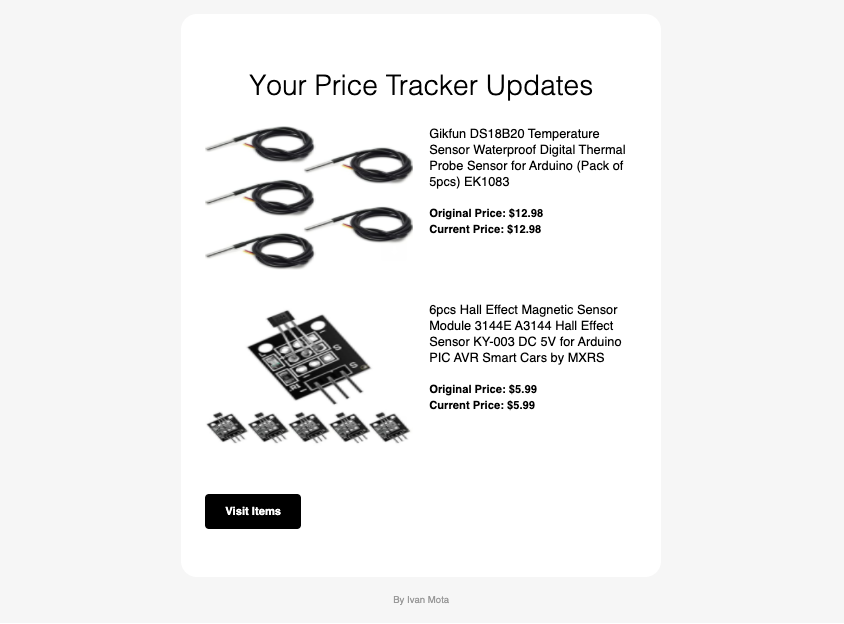

# Description
*Price Tracker* is a full-stack web application to save your [Amazon](https://amazon.com) items and get daily emails to check when their prices drop.

### Demo

### Daily email demo

### Technologies
Full-Stack web application that uses:
* [Flask](https://flask.palletsprojects.com/en/1.1.x/) for the Back-End
* [React](https://reactjs.org/) for the Front-End
* [MongoDB](https://www.mongodb.com/) for the database.

### How it works?
* Price Tracker uses the python library [Beautiful Soup](https://www.crummy.com/software/BeautifulSoup/bs4/doc/) to access amazon links and extract their information such as product name, image, and price.
* Using [Flask](https://flask.palletsprojects.com/en/1.1.x/), the application connects to the [MongoDB](https://www.mongodb.com/) database to store and extract the products saved by the user.
* Every 24 hours, the application checks if one of the saved products' price changed and sends an email to the user using a [SMTP protocol client](https://docs.python.org/3/library/smtplib.html) library.

### License
Copyright (c) 2020 [Ivan Mota](https://ivanmtta.github.io/)
Released under the MIT License
